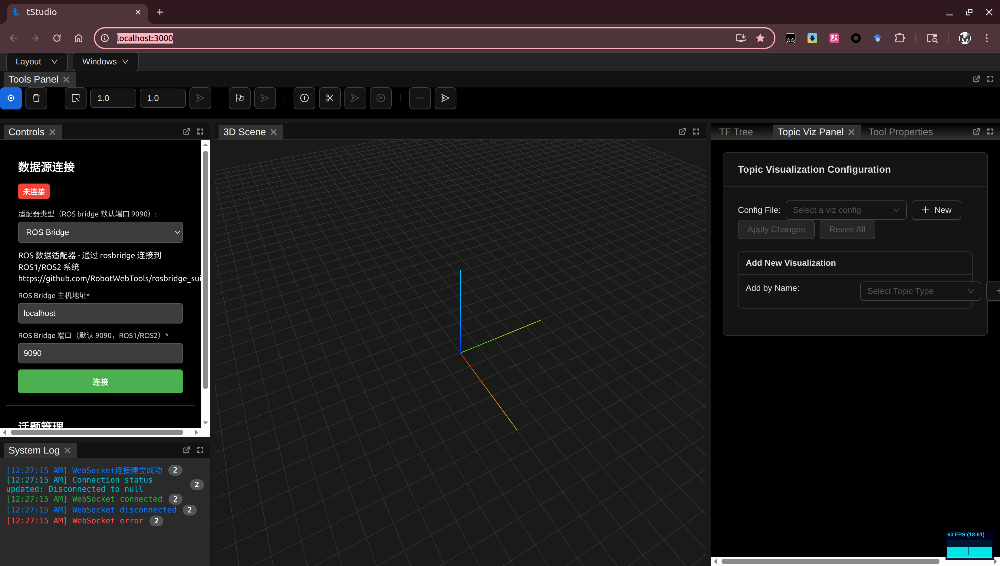

# tStudio 使用与架构说明

tStudio 是一个面向机器人系统的可视化与调试工具，包含 React 前端与 FastAPI 后端，支持通过 ROS Bridge 订阅 ROS1/ROS2 话题（消息类型自动兼容），并提供插件化的消息处理与三维场景可视化能力。

## 前置条件
- 已安装 `Node.js >= 18` 与 `npm`
- 已安装 `Python >= 3.10` 与 `pip`
- 已安装 `make`

## 一键安装
在项目根目录运行：

```
make install
```

该命令会：
- 在 `frontend/` 执行 `npm install`
- 在 `backend/` 执行 `pip install -r requirements.txt`

后端依赖包括：`fastapi`、`uvicorn`、`roslibpy` 等（见 `backend/requirements.txt`）。

## 一键启动（开发模式）

```
make dev
```

启动后：
- 前端开发服务器：`http://localhost:3000/`
- 后端 API：`http://localhost:3500/`（示例：`http://localhost:3500/api/params/...`）
- 后端 WebSocket：`ws://localhost:3500/api/ws`

前端会直接请求后端的 `3500` 端口，无需额外代理。

后端默认启用 CORS，允许跨域访问（`backend/main.py`）。

## 手动启动（可选）

1) 后端：

```
cd backend
pip install -r requirements.txt
python main.py
```

后端默认监听 `0.0.0.0:3500` 并启用热重载。

2) 前端：

```
cd frontend
npm install
npm start
```

前端默认在 `http://localhost:3000/` 启动。

若需生产构建：

```
cd frontend
npm run build
```

## 可选配置
- 覆盖前端调用的 API 根地址：设置环境变量 `REACT_APP_API_URL`（默认：`http://localhost:3500/api/params`，参见 `frontend/src/services/ParameterService.js`）。

示例：

```
REACT_APP_API_URL=http://<your-host>:3500/api/params npm start
```

## 清理

```
make clean
```

## 参考位置
- 启动脚本：`tStudio/Makefile`
- 后端端口：`tStudio/backend/main.py`（`uvicorn.run(..., port=3500)`）
- 前端脚本：`tStudio/frontend/package.json`（`npm start`）
- 前端 API 默认地址：`tStudio/frontend/src/services/ApiService.js`（`BASE_URL=http://localhost:3500/api`）
- 前端 WebSocket 默认地址：`tStudio/frontend/src/services/WebSocketManager.js`（`ws://localhost:3500/api/ws`）

## 功能概览
- 话题订阅与消息展示：通过 ROS Bridge 订阅话题，自动识别消息类型并渲染到三维场景或文本面板（`backend/adapters/ros_adapter.py`、`frontend/components`）。
- 插件化处理链（后端）：消息在进入前端前可被后端插件处理或过滤，支持精确匹配与通配（`backend/plugins`）。
- 可视化插件（前端）：为不同消息类型提供直观渲染（点云、路径、图像、TF 等）（`frontend/src/components/plugins`）。
- 布局管理：支持 FlexLayout 布局，提供多个 UI 面板插件（`frontend/src/ui-plugins`），布局配置存储于 `backend/configs/layouts/active/`。
- 参数管理：后端提供统一的参数树接口，支持加载、保存与元数据（`backend/api/api_params.py`、`backend/params`）。

### 界面与操作（示意图）

- 顶部工具栏：相机控制（平移/缩放/旋转）、`select area`/`2d nav goal`等基础工具。
- 左侧“Controls”面板：
  - 数据源连接：选择 `ROS Bridge`，填入主机与端口（默认 `localhost:9090`），点击“连接”。
  - 连接状态与日志在下方“System Log”面板实时显示（WebSocket 连接、错误提示等）。
- 中央“3D Scene”面板：
  - 显示坐标轴与网格，订阅后将动态渲染点云、路径、图像和 TF 框架等。
- 右侧“Topic Viz Panel”面板：
  - 可选择或新建可视化配置文件（Config File）。
  - “Add New Visualization”支持按类型添加可视化组件（例如 `sensor_msgs/PointCloud2`、`nav_msgs/Path`、`tf2_msgs/TFMessage`）。
  - 每种类型拥有独立的显示参数（颜色、大小、是否显示辅助要素等），可应用或回滚修改。

## 架构与数据流
- 连接：前端通过 REST 与 WebSocket 与后端交互（`frontend/src/services/ApiService.js`、`WebSocketManager.js`）。
- ROS 数据源：后端通过 `roslibpy` 连接 ROS Bridge，拉取话题列表、订阅消息并广播到所有前端客户端（`backend/adapters/ros_adapter.py`、`backend/main.py`）。
- 插件管线（后端）：
  - 插件注册与发现：`backend/plugins/__init__.py`、`plugin_manager.py`
  - 匹配规则：`message_type#topic`，支持 `*` 通配；为兼容 ROS1/ROS2，后端在匹配前将类型字符串统一为不含 `/msg/` 的格式，并标准化话题名（`plugin_manager.py`）。
- 可视化管线（前端）：
  - 插件选择：根据消息类型归一化（将 `xxx/msg/Type` 规整为 `xxx/Type`），选中合适的插件（`frontend/src/components/plugins/base/VisualizationPlugin.js`）。
  - TF 支持：`TFVisualizerPlugin` 与 `TFManager` 提供 TF 帧渲染与层级关系展示（`frontend/src/components/plugins/tf/TFVisualizerPlugin.js`、`frontend/services/TFManager`）。

## 常用操作
- 获取话题列表：`GET /api/topics`（`backend/api/api_topics.py`）。
- 订阅话题：`POST /api/topics/subscribe`，参数：`topic`、可选 `message_type`（若省略则后端自动查询类型）。
- 断开连接：`POST /api/connection/disconnect`。
- 参数读取与保存：`/api/params/*` 路径，详见接口（`backend/api/api_params.py`）。

前端界面操作建议：
- 打开左侧“Controls”面板连接 ROS Bridge → 在右侧“Topic Viz Panel”选择可视化类型 → 在“3D Scene”观察渲染效果。
- 若需要 TF 可视化与坐标系树，打开“TF Tree”面板或添加 TF 可视化插件。

## ROS1/ROS2 兼容性说明
- 类型字符串归一化：
  - ROS1：`pkg/Type`
  - ROS2：`pkg/msg/Type`
  - 系统会自动将 ROS2 字符串转换为 ROS1 风格进行匹配与渲染。
- 话题名标准化：统一加前导 `/` 并移除重复斜杠，确保匹配稳定（后端插件管线）。

## 测试
- 后端接口测试示例：`backend/tests/`（`test_api_data.py`、`test_api_params.py`）。

## 目录指引
- 前端入口：`frontend/src/App.js`
- UI 插件注册：`frontend/src/ui-plugins/index.js`
- 可视化插件注册：`frontend/src/components/plugins/index.js`
- 后端应用入口：`backend/main.py`
- ROS 适配层：`backend/adapters/ros_adapter.py`
- 插件系统：`backend/plugins/`
- 参数系统：`backend/params/`
